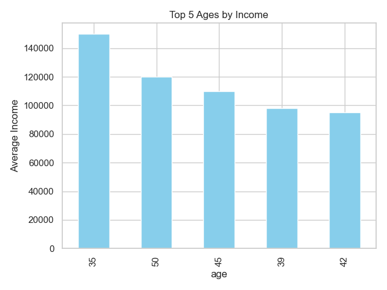
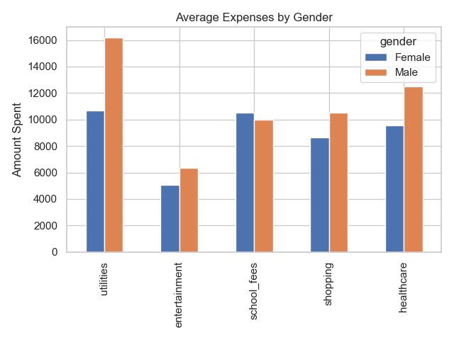

# Income and Expense Survey Tool

## Overview

This project is a full-stack web application designed to collect and analyze participants' income and spending patterns. It was developed using **Flask** for the backend, **MongoDB** for data storage, **Python** for data processing, and **Jupyter Notebook** for visualization. The tool is intended to assist in market analysis ahead of a new product launch in the healthcare industry.

---

## 🧰 Features

- **Flask Web Interface** for collecting user details.
- **MongoDB Integration** for persistent storage.
- **Dynamic Form** with checkboxes and textboxes for expense input.
- **User Class in Python** for data extraction and CSV generation.
- **Jupyter Notebook** for data visualization and reporting.
- **AWS Deployment** for remote accessibility.

---

## Tech Stack

- **Backend:** Flask (Python)
- **Database:** MongoDB
- **Data Processing:** Python
- **Visualization:** Seaborn, Matplotlib (Jupyter Notebook)
- **Cloud Deployment:** AWS EC2

---

## Application Flow

1. User visits the Flask web interface and submits a form with:
   - Age
   - Gender
   - Total Income
   - Expenses (via checkboxes and input fields)

2. Data is stored in **MongoDB**.

3. A Python script extracts the data, processes it using a `User` class, and writes it to a **CSV file**.

4. The CSV is analyzed in a **Jupyter Notebook**, which:
   - Displays age groups with the highest income
   - Shows gender-wise distribution of expenses across categories
   - Exports charts as image files for PowerPoint presentation

5. Flask app is **hosted on AWS** using EC2 with Gunicorn + Nginx.

---

## 🗂️ Folder Structure

```
flask-health-application/
├── app/
│   ├── templates/
│   │   └── index.html
│   │   └── submissions.html        # For displaying data on the browser
│   │   └── success.html
│   │   └── error.html
│   ├── static/
│   │   ├── css/
│   │   └── js/
│   ├── __init__.py
│   ├── routes.py
│   └── mongodb_util.py             # Returns DB connection
├── data/
│   ├── survey_data.csv             # Data file
│   └── charts/
│       ├── top_ages_income.png
│       ├── gender_distribution.png
├── notebooks/
│   └── analysis.ipynb              # Jupyter Notebook for visualization
├── run.py                          # App entry point
├── requirements.txt                # App entry point
├── README.md
└── flask-health-application        # Zip file for project submission
```

---

## 🔧 Setup Instructions

### 1. Clone the Repository (or download the zip file)

```bash
git clone https://github.com/malachmochache/flask-healthcare-application.git
cd flask-healthcare-application
```

### 2. Install Dependencies

```bash
pip install -r requirements.txt
```

### 3. Run the Flask App remotely
Open your browser:

👉 Visit `http://54.210.137.2/` to use the data collection form

---

## 🏗️ Data Analysis & Visualization

1. Export the data into a CSV file
2. Navigate to the `notebooks/` folder and open `analysis.ipynb` in Jupyter:

    ```bash
    jupyter notebook
    ```

    The notebook will:

    - Load data from `data/survey_data.csv`
    - Generate visual charts for:
    - Top income-earning age groups
    - Gender-wise expense category breakdown
3. You can view an executed notebook here: https://github.com/malachmochache/flask-healthcare-application/blob/main/notebooks/analysis.ipynb

---

## Screenshots

<p align="center">
  
  
</p>

---


## 👨‍🎓 Author

Malach Mochache | Nexford University
